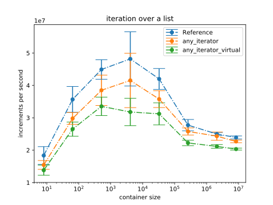
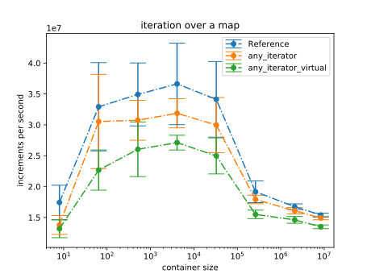
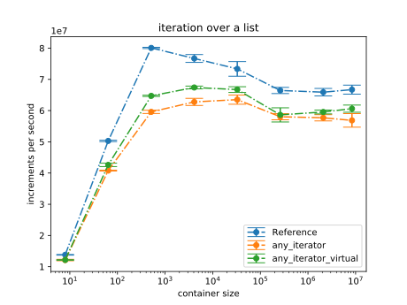
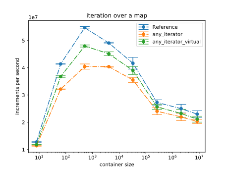

# Performance

Below are some performance tests for iteration using the any_iterator.
There are no tests for comparing the std\::vector\::iterator, since the performance impact
of a simple pointer increment on a continious memory area is too huge and any_iterator was not desgined
for such a purporse.

Tests includes the performance impact given an iterator of std\::map or std\::list using the native vs. any iterator.
The third iterator, any_iterator_virtual, is an alternative implementation of any_iterator using an abstract class.

Tested Compilers:
  - [MSVC 2017](msvc-2017)
  - [GCC 8.1](gcc-8.1)

## MSVC 2017

Using MSVC 2017 (Release, x64, default config with /O2) with
4 X 3400 MHz CPU (Intel i5-4670)
16GB RAM

## GCC 8.1

Using GCC 8.1 (Release, -O3) with 
2 X 2200 MHz CPU (Intel i5-5200U)
8GB RAM

